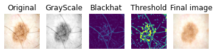
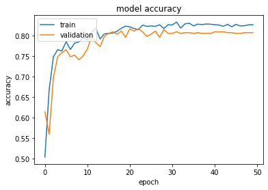
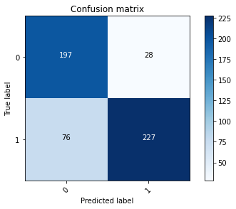

# Skin Cancer Classification
Detecting melanoma with a CNN

Skin cancer is the most common human malignancy, is primarily diagnosed visually, beginning with an initial clinical screening and followed potentially by dermoscopic analysis, a biopsy and histopathological examination. Automated classification of skin lesions using images is a challenging task owing to the fine-grained variability in the appearance of skin lesions.

This is the "Skin Cancer: Malignant vs Benign" (https://www.kaggle.com/datasets/fanconic/skin-cancer-malignant-vs-benign) dataset. It consists of two folders with each 1800 pictures (224x244) of a balanced set of images of benign skin moles and malignant skin moles. All the rights of the Data are bound to the ISIC-Archive rights (https://www.isic-archive.com/#!/topWithHeader/wideContentTop/main).

In this project I will try to detect whether a sind lesion is malignant or not using CNN with keras tensorflow in backend and then analyse the result to see how the model can be useful in practical scenario.

## 1. Data Preparation

First of all, it is essential to clean up the data as it becomes difficult for the networks to learn the features since, most of the skin images are occluded by hair. Thus, there is a need for pre-processing of the skin images to remove these obstructing hair. I remove the hair noise from the skin image with the help of Morphological filtering. 

To further improve accuarcy and preventing overfitting I used Data Augmentation by rotating, shifting, zooming and flipping the Image. In Addition to that I split the Data in a training and validation set with a ratio of (8:2).

## 2. Training the Model 

I used the Keras Sequential API, where you have just to add one layer at a time, starting from the input.

I choose to set two 2DConv filter, one of them a 32x32 with a kernel size of 3x3 and the second a 64x64 with the same kernel size. From this a CNN is able to isolate features that are useful everywhere from these transformed images (feature maps). Subsequently I added two max pooling layers to combine local feautures which the CNN learned and to learn more global features from the image. To reduce overfitting I added a dropout layer as a regularization method.
In the end i used the features in two fully-connected (Dense) layers which is essentially just artificial an neural networks (ANN) classifier. In the last layer(Dense(2,activation="softmax")) the net outputs distribution of probability of each class.

## 3. Evaluation

The model has a validation accuarcy of approximately 80% which is pretty good considering the network is a shallow model. If you would use transfer model like for instance ResNet50 you would get a much higher accuarcy. 

In Addition I tested the model and plotted a confusion matrix where "0" is cancer and "1" is non cancer. 

